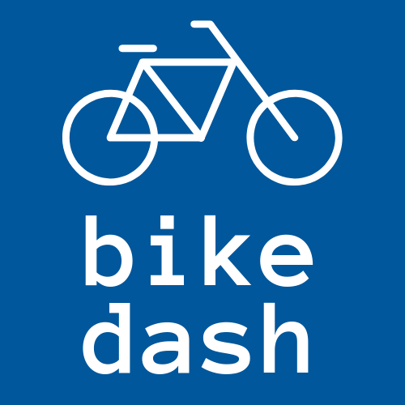
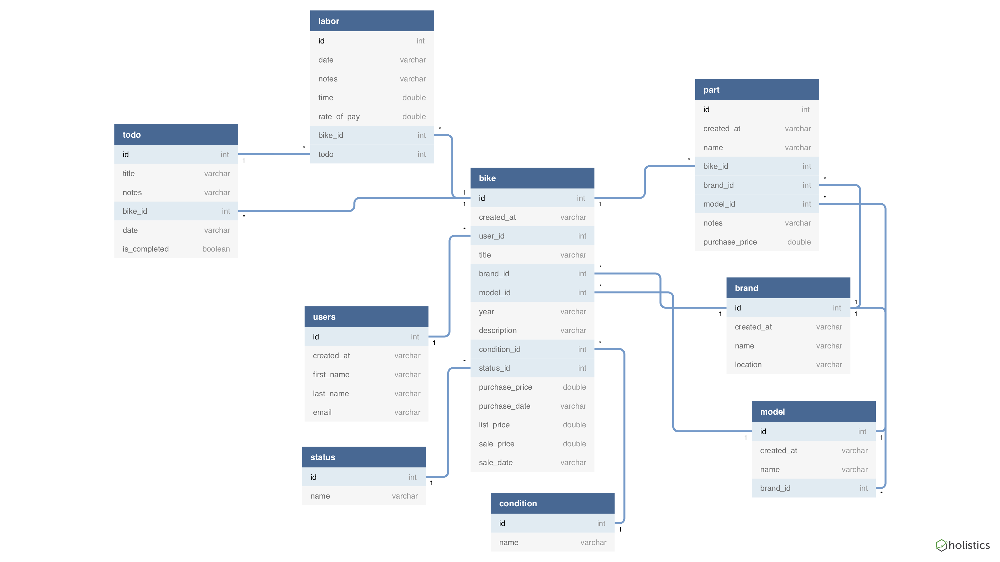

# Welcome to Bike Dash!

> A Python Django web app that allows users to track their bike inventory, todo checklist, and profit from sales.

## Background
As a hobby, my dad buys bikes from pawn shops in Salt Lake City, Utah and then he rebuilds/upgrades the bikes to sell online. I asked him how he tracks his inventory and his sales and his response was, "I start with money in an envelope, and I hope that I end up with more money in the envelope at the end of the year than what I started with". That's when I decided to build him this app.

## General app functionality 
The following functionalities are part of Bike Dash:

1. User registration (forked from Steve and Joe - thanks! ;) )
1. User login (forked from Steve and Joe)
1. User logout (forked from Steve and Joe)
1. Bikes: add, edit, list, detail
1. Bike Brands: add, edit, list 
1. Bike models: add, edit, list
1. Parts: add, edit, list, detail
1. Todos: add, edit, list, delete
1. Labor: add, edit, list, detail

## App flow
This app has 4 goals:
1. Track bike and bike part inventory
1. Track Todos and labor for those Todo items
1. Track bike status (in process, listed, sold) 
1. Review bike profits and other related data

Typical flow: 

1. Add a new bike to your inventory
1. Create any todos as you work on the bike
1. Add new parts from your part inventory to the bike
1. Add labor records to track time spent and rate of pay for todo items
1. Repeat adding parts/adding todos/recording labor as you work on the bike (you can also add labor independent of a part if you're working on maintenance or an existing part)
1. Once you're ready, list the bike for sale - the "list your bike for sale" page will show the breakeven price of the bike (purchase price + labor + parts)
1. Once you've sold the bike, record the sale price and date
1. Check your dashboard to see your reporting on sales, inventory, labor, etc.

## FYI
**Note about bike brands & bike models** - Users can add a bike brand (like Specialized) as well as models for that brand. This data is open to all users - if you add a bike brand and/or model, the other users will be able to see that added data. In a perfect world, this would not be user generated data - someday I might scrape some data to populate the database with common bike brands/models. I am hoping to add more functionality to this, such as checking that the brand/model isn't already in the db.

Bikes, Parts, Todos, and Labor are unique to the current user and can only be viewed by the logged in user.

## ERD

### To dos & Labor 
A Todo must be assigned when selecting to record labor, but a todo can be completed without any labor recorded. This is for those who don't want to track their labor time/rate of pay, and would prefer to simply have a checklist of todos as they work on their bikes.

### Parts
When a user adds a part, the brand and model of the part can be added in one of two ways: 
1. Add from the dropdown that is populated from the bike brands/bike models (for example, if you have a frame by a specific bike manufacturer, you can select the brand from the dropdown)
1. Fill in the make and model input fields - this saves a string for both make and model on that part
Either the dropdowns _or_ the input fields must be filled out

### Status & Condition
The data for these items is default to the app and are not editable. 
- Statuses: In process, listed for sale, sold
- Condition: New, Good, Fair, Poor

## To Clone

1. Create a directory
1. `cd` into that directory
1. Clone the repository
1. Start a virtual environment
1. run `pip install django`
1. run `pip install safedelete`
1. run `pip install crispy_forms`
1. Create migrations `python manage.py makemigrations bikes`
1. Apply migrations to db `python manage.py migrate`
1. run `python manage.py runserver`
1. Open up your browser and navigate to the running server
1. Register, add bikes/parts/todos/labor, and you're on your way!

## Created by Kimmy Bird
I'm a graduate of [Nashville Software School](http://nashvillesoftwareschool.com/) and am currently a Junior Instructor at NSS. Learn more about me at [kimberlybird.me](https://www.kimberlybird.me/)

